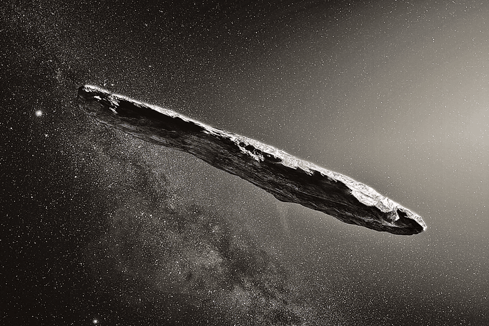

# Ouamuamua Investigations

Oumuamua is the first interstellar object detected passing through the Solar System.[21] Formally designated 1I/2017 U1, it was discovered by Robert Weryk using the Pan-STARRS telescope at Haleakalā Observatory, Hawaii, on 19 October 2017, approximately 40 days after it passed its closest point to the Sun on 9 September. When it was first observed, it was about 33 million km (21 million mi; 0.22 AU) from Earth (about 85 times as far away as the Moon) and already heading away from the Sun.

(c) [Wikipedia](https://en.wikipedia.org/wiki/%CA%BBOumuamua)

### Sources:

[NASA Discovery](https://solarsystem.nasa.gov/asteroids-comets-and-meteors/comets/oumuamua/in-depth/)

### More in communities:

- [Chinese scientists reject the idea that the 'Oumuamua interstellar object is an alien ship](https://naked-science.ru/community/499058)

- ['Oumuamua turned out to be an asteroid, not an alien ship](https://naked-science.ru/article/astronomy/not-alien-asteroid)

- [The James Webb Space Telescope will be able to view the next Oumuamua](https://naked-science.ru/community/403916)
